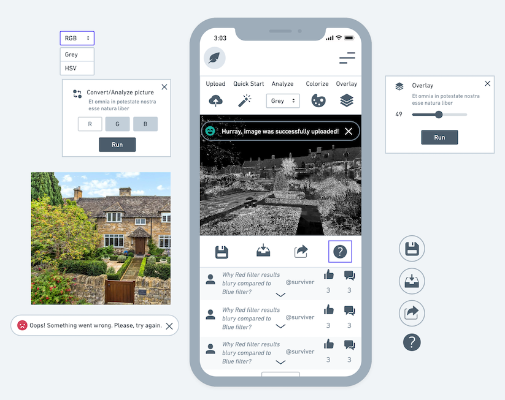
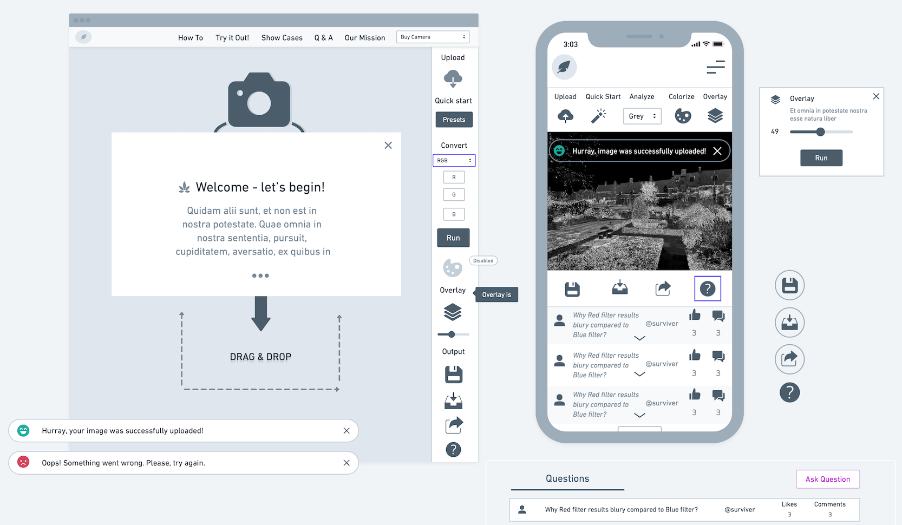
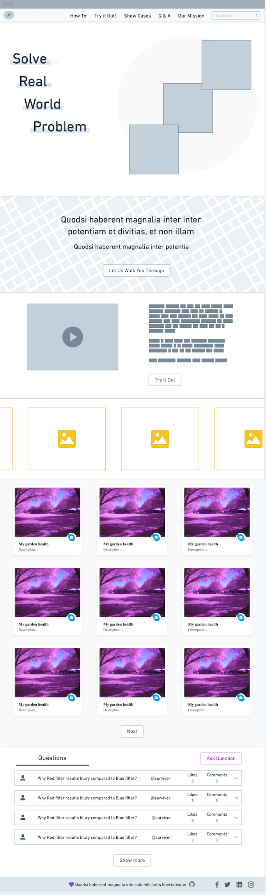

# Publiclab-Mockup

Designing a new full-screen user interface for Infragram.org The Infragram project brings together a range of different efforts to make Do-It-Yourself plant health comparisons possible with infrared photography. Infragram.org enables people with Infragram-modified cameras to upload photos for analysis and conversion using techniques like NDVI (used in satellite imaging analysis). It also allows for live streaming from a modified webcam. This project will overhaul the UI of Infragram to be full-screen and create space for new features like multiple resolutions of video, dragging in a recorded video instead of a still image for conversion, and pop up panels with Q&A, tips, tutorials, and more, so that they can feature more helpful guidance text.

## Mobile version - Infragram Sandbox

## Web version - Infragram Sandbox

## Homepage of Infragram.com

